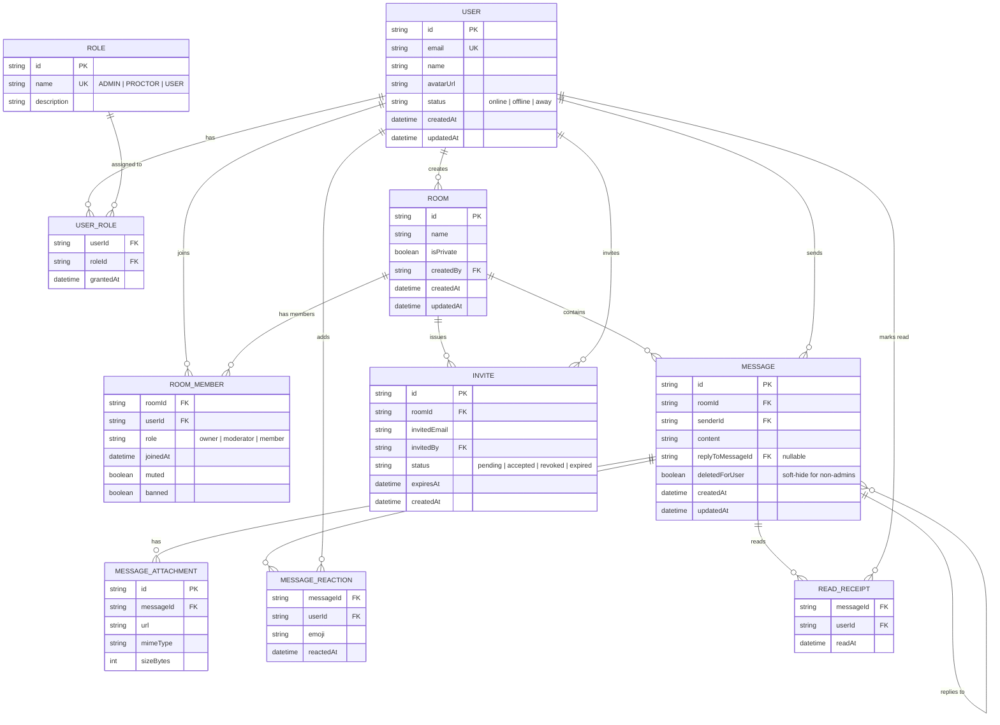

```mermaid
erDiagram
  USER {
    string id PK
    string email UK
    string name
    string avatarUrl
    string status          "online | offline | away"
    datetime createdAt
    datetime updatedAt
  }

  ROLE {
    string id PK
    string name UK         "ADMIN | PROCTOR | USER"
    string description
  }

  USER_ROLE {
    string userId FK
    string roleId FK
    datetime grantedAt
  }

  ROOM {
    string id PK
    string name
    boolean isPrivate
    string createdBy FK
    datetime createdAt
    datetime updatedAt
  }

  ROOM_MEMBER {
    string roomId FK
    string userId FK
    string role         "owner | moderator | member"
    datetime joinedAt
    boolean muted
    boolean banned
  }

  MESSAGE {
    string id PK
    string roomId FK
    string senderId FK
    string content
    string replyToMessageId FK "nullable"
    boolean deletedForUser     "soft-hide for non-admins"
    datetime createdAt
    datetime updatedAt
  }

  MESSAGE_ATTACHMENT {
    string id PK
    string messageId FK
    string url
    string mimeType
    int    sizeBytes
  }

  MESSAGE_REACTION {
    string messageId FK
    string userId FK
    string emoji
    datetime reactedAt
  }

  READ_RECEIPT {
    string messageId FK
    string userId FK
    datetime readAt
  }

  INVITE {
    string id PK
    string roomId FK
    string invitedEmail
    string invitedBy FK
    string status       "pending | accepted | revoked | expired"
    datetime expiresAt
    datetime createdAt
  }

  %% Relationships
  USER ||--o{ USER_ROLE : "has"
  ROLE ||--o{ USER_ROLE : "assigned to"

  USER ||--o{ ROOM : "creates"
  USER ||--o{ ROOM_MEMBER : "joins"
  ROOM ||--o{ ROOM_MEMBER : "has members"

  ROOM ||--o{ MESSAGE : "contains"
  USER ||--o{ MESSAGE : "sends"

  MESSAGE ||--o{ MESSAGE_ATTACHMENT : "has"
  MESSAGE ||--o{ MESSAGE_REACTION   : "gets"
  USER ||--o{ MESSAGE_REACTION      : "adds"

  MESSAGE ||--o{ READ_RECEIPT : "reads"
  USER ||--o{ READ_RECEIPT    : "marks read"

  MESSAGE ||--o{ MESSAGE : "replies to" 

  ROOM ||--o{ INVITE : "issues"
  USER ||--o{ INVITE : "invites"

```